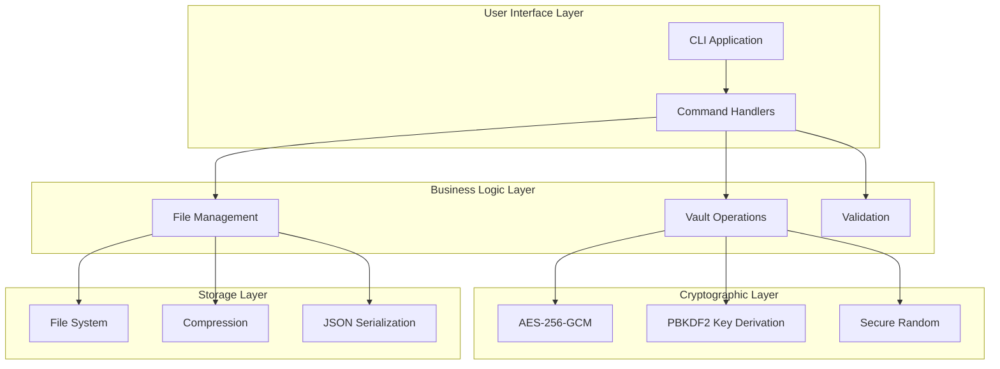
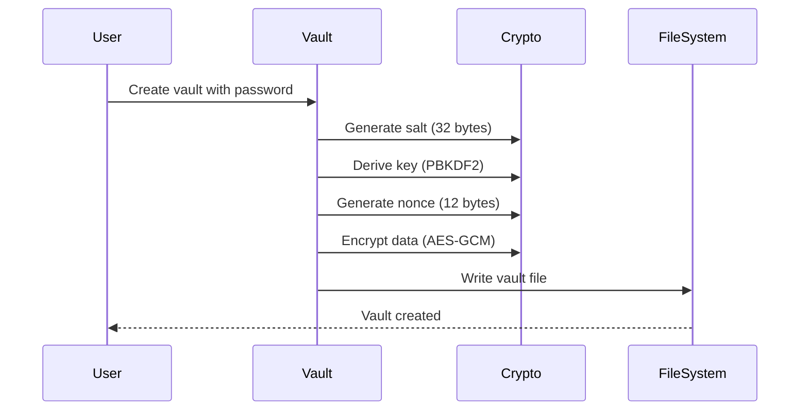
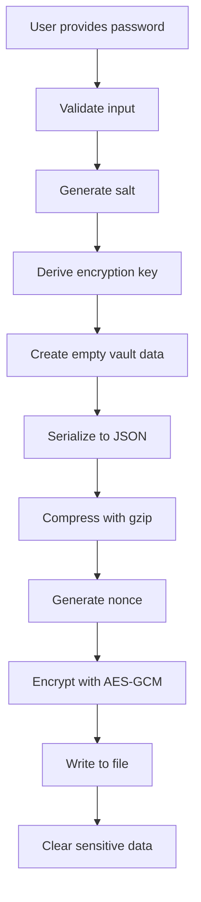
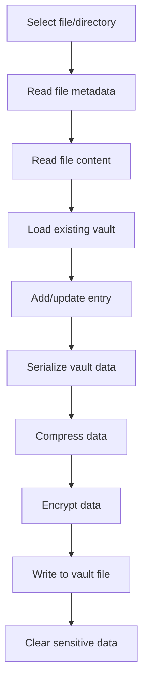
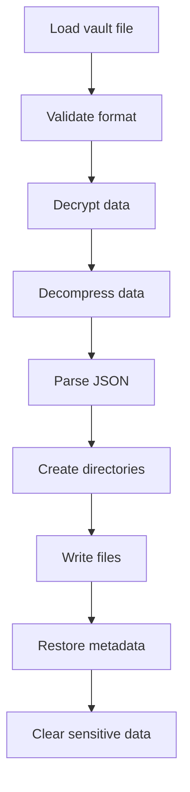
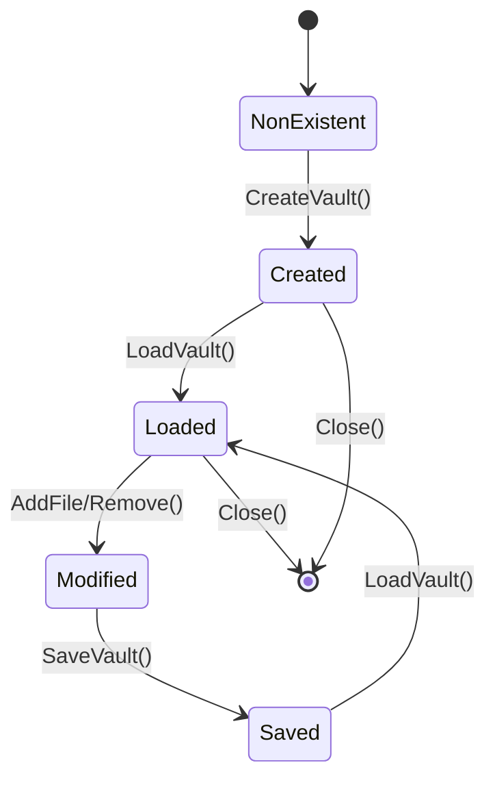

# 🏗️ Architecture Overview

This document provides a comprehensive overview of Flint Vault's architecture, design decisions, and implementation details.

## 🎯 Design Goals

### Primary Goals
- **Security**: Military-grade encryption with proven algorithms
- **Reliability**: Robust error handling and data integrity
- **Performance**: Efficient operations with large files
- **Usability**: Simple CLI interface and clear documentation
- **Portability**: Cross-platform compatibility

### Non-Goals
- Real-time collaboration
- Network synchronization
- GUI interface
- Plugin architecture

## 🏛️ System Architecture

### High-Level Overview



### Layer Responsibilities

#### 1. User Interface Layer
- **CLI Application** (`cmd/main.go`)
  - Command parsing
  - User input handling
  - Output formatting
  - Error presentation

- **Command Handlers** (`pkg/commands/`)
  - Business logic orchestration
  - Input validation
  - Progress reporting

#### 2. Business Logic Layer
- **Vault Operations** (`pkg/lib/vault/create.go`)
  - Vault lifecycle management
  - Encryption/decryption coordination
  - Password handling

- **File Management** (`pkg/lib/vault/files.go`)
  - File and directory operations
  - Metadata preservation
  - Path management

- **Validation** (distributed)
  - Input sanitization
  - Security checks
  - Format validation

#### 3. Cryptographic Layer
- **AES-256-GCM**: Authenticated encryption
- **PBKDF2**: Key derivation from passwords
- **Secure Random**: Cryptographically secure randomness

#### 4. Storage Layer
- **File System**: Platform-specific I/O
- **Compression**: gzip data compression
- **JSON Serialization**: Structured data storage

## 📁 Module Structure

### Core Modules

```
pkg/lib/vault/
├── create.go          # Vault creation and core crypto
├── files.go          # File and directory operations  
├── open.go           # Vault opening and validation
└── types.go          # Data structures and constants
```

#### create.go - Core Cryptographic Operations
```go
// Key functions:
func CreateVault(vaultPath, password string) error
func saveVaultData(vaultPath, password string, data VaultData) error
func loadVaultData(vaultPath, password string) (*VaultData, error)
func deriveKey(password string, salt []byte) []byte
```

**Responsibilities:**
- Vault file creation
- Encryption/decryption
- Key derivation
- Memory management

#### files.go - File Operations
```go
// Key functions:
func AddFileToVault(vaultPath, password, filePath string) error
func AddDirectoryToVault(vaultPath, password, dirPath string) error
func ExtractVault(vaultPath, password, destDir string) error
func RemoveFromVault(vaultPath, password, targetPath string) error
```

**Responsibilities:**
- File and directory handling
- Metadata preservation
- Path normalization
- Compression management

#### open.go - Vault Access
```go
// Key functions:
func ListVault(vaultPath, password string) (*VaultData, error)
func GetFileFromVault(vaultPath, password, targetPath string) ([]byte, error)
```

**Responsibilities:**
- Vault reading
- Content listing
- File extraction

### Command Layer

```
pkg/commands/
├── commands.go        # CLI command definitions
└── commands_test.go   # Integration tests
```

**Architecture Pattern:** Command Pattern
- Each command encapsulates a complete operation
- Uniform interface for all commands
- Easy to test and extend

## 🔐 Security Architecture

### Cryptographic Design

#### Encryption Flow


#### File Format
```
Vault File Structure:
┌─────────────────────────────────────────┐
│ Magic Header: "FLINT001" (8 bytes)     │
├─────────────────────────────────────────┤
│ Salt: Random bytes (32 bytes)          │
├─────────────────────────────────────────┤
│ Nonce: Random bytes (12 bytes)         │
├─────────────────────────────────────────┤
│ Encrypted Data: AES-256-GCM            │
│ ┌─────────────────────────────────────┐ │
│ │ JSON Data + gzip compression        │ │
│ │ ┌─────────────────────────────────┐ │ │
│ │ │ VaultData structure             │ │ │
│ │ │ - Entries[]                     │ │ │
│ │ │ - CreatedAt                     │ │ │
│ │ │ - Comment                       │ │ │
│ │ └─────────────────────────────────┘ │ │
│ └─────────────────────────────────────┘ │
├─────────────────────────────────────────┤
│ Auth Tag: GCM tag (16 bytes)           │
└─────────────────────────────────────────┘
```

### Security Properties

#### Confidentiality
- **AES-256**: 256-bit key size provides 2^256 security
- **GCM Mode**: Semantic security against chosen plaintext attacks
- **Unique Nonces**: Prevent pattern analysis

#### Integrity  
- **GCM Authentication**: 128-bit authentication tag
- **Magic Header**: Format validation
- **JSON Schema**: Structure validation

#### Authentication
- **Password Verification**: PBKDF2 with high iteration count
- **Salt Uniqueness**: Prevents rainbow table attacks
- **Constant-Time Comparison**: Prevents timing attacks

## 📊 Data Flow

### Vault Creation Flow


### File Addition Flow


### File Extraction Flow


## 🔄 State Management

### Vault State Transitions



### Data Consistency

#### ACID Properties
- **Atomicity**: Operations complete fully or not at all
- **Consistency**: Vault structure always valid
- **Isolation**: No concurrent modification support
- **Durability**: Changes persisted to disk

#### Error Recovery
- Temporary files for atomic operations
- Validation before overwriting
- Backup strategies recommended

## 🚀 Performance Architecture

### Memory Management

#### Memory Usage Patterns
```go
// Efficient memory usage
func processLargeFile(file string) error {
    // Stream processing instead of loading entire file
    reader, err := os.Open(file)
    if err != nil {
        return err
    }
    defer reader.Close()
    
    buffer := make([]byte, 64*1024) // 64KB buffer
    for {
        n, err := reader.Read(buffer)
        if err == io.EOF {
            break
        }
        // Process chunk
        processChunk(buffer[:n])
    }
    return nil
}
```

#### Memory Safety
- Automatic garbage collection
- Explicit sensitive data clearing
- Buffer size limits
- Memory pool for frequent operations

### I/O Optimization

#### Buffered Operations
```go
// Buffered file writing
func writeVaultData(w io.Writer, data []byte) error {
    buffered := bufio.NewWriterSize(w, 64*1024)
    defer buffered.Flush()
    
    _, err := buffered.Write(data)
    return err
}
```

#### Compression Strategy
- **Level 6**: Balance between size and speed
- **Streaming**: Process large files without full memory load
- **Adaptive**: Skip compression for small files

### Scalability Considerations

#### File Size Limits
- **Theoretical**: Limited by available memory and disk space
- **Practical**: Tested with 1GB+ files
- **Recommendation**: Split very large files for better performance

#### Vault Size Management
- Single vault file per instance
- No size limits beyond filesystem constraints
- Memory usage scales with file count, not file size

## 🔧 Extension Points

### Future Enhancements

#### Cryptographic Agility
```go
// Interface for different encryption algorithms
type Encryptor interface {
    Encrypt(data []byte, key []byte) ([]byte, error)
    Decrypt(ciphertext []byte, key []byte) ([]byte, error)
    KeySize() int
    NonceSize() int
}

// Current implementation
type AESGCMEncryptor struct{}

// Future implementations
type ChaCha20Poly1305Encryptor struct{}
type PostQuantumEncryptor struct{}
```

#### Pluggable Storage
```go
// Storage abstraction
type VaultStorage interface {
    Write(path string, data []byte) error
    Read(path string) ([]byte, error)
    Exists(path string) bool
    Delete(path string) error
}

// Implementations
type FileSystemStorage struct{}
type CloudStorage struct{}
type DatabaseStorage struct{}
```

#### Compression Options
```go
// Compression abstraction
type Compressor interface {
    Compress(data []byte) ([]byte, error)
    Decompress(data []byte) ([]byte, error)
    Name() string
}

// Implementations
type GzipCompressor struct{}
type ZstdCompressor struct{}
type LZ4Compressor struct{}
```

## 🧪 Testing Architecture

### Test Pyramid

```
    ┌─────────────────┐
    │   E2E Tests     │  CLI integration tests
    │                 │  Full workflow validation
    ├─────────────────┤
    │ Integration     │  Component interaction tests
    │ Tests           │  File system operations
    │                 │  Crypto integration
    ├─────────────────┤
    │                 │  Function-level tests
    │   Unit Tests    │  Mocked dependencies
    │                 │  Edge cases
    │                 │  Error conditions
    └─────────────────┘
```

### Test Categories

#### Security Tests
- Cryptographic correctness
- Attack scenario simulation
- Side-channel resistance
- Memory safety validation

#### Performance Tests
- Benchmark operations
- Memory profiling
- Large file handling
- Concurrent access patterns

#### Compatibility Tests
- Cross-platform validation
- Unicode support
- File system permissions
- Edge case handling

## 📈 Monitoring and Observability

### Error Handling Strategy

#### Error Classification
```go
// Error types
type VaultError struct {
    Type    ErrorType
    Message string
    Cause   error
}

const (
    ErrorTypeAuth      ErrorType = "authentication"
    ErrorTypeCrypto    ErrorType = "cryptographic"
    ErrorTypeFileIO    ErrorType = "file_io"
    ErrorTypeValidation ErrorType = "validation"
)
```

#### Logging Strategy
- Minimal logging by default
- Debug mode for development
- No sensitive data in logs
- Structured error reporting

### Performance Metrics

#### Key Metrics
- Vault creation time
- File addition throughput
- Memory usage patterns
- Disk space efficiency

#### Profiling Integration
```go
// Built-in profiling support
import _ "net/http/pprof"

func enableProfiling() {
    go func() {
        log.Println(http.ListenAndServe("localhost:6060", nil))
    }()
}
```

## 🔮 Future Architecture Considerations

### Post-Quantum Cryptography
- Algorithm migration path
- Hybrid security models
- Backward compatibility

### Distributed Storage
- Cloud storage backends
- Synchronization protocols
- Conflict resolution

### Advanced Features
- Incremental backups
- Deduplication
- Version control
- Access control lists

---

**Architecture Philosophy**: Simple, secure, and maintainable design that prioritizes security and reliability over feature richness. 