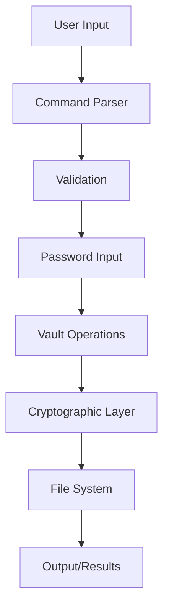

# 🛠️ Development Guide

This guide covers everything needed to contribute to Flint Vault development.

## 🏗️ Project Structure

```
flint-vault/
├── cmd/                     # Main application entry point
│   └── main.go             # CLI application
├── pkg/                    # Go packages
│   ├── commands/           # CLI command implementations
│   │   ├── commands.go     # Command definitions
│   │   └── commands_test.go # Command tests
│   └── lib/
│       └── vault/          # Core vault library
│           ├── create.go    # Vault creation & crypto
│           ├── files.go     # File operations
│           ├── open.go      # Vault opening
│           ├── create_test.go # Creation tests
│           ├── files_test.go  # File operation tests
│           └── security_test.go # Security tests
├── docs/                   # Documentation
├── test_data/             # Test files
├── go.mod                 # Go module definition
├── go.sum                 # Dependency checksums
└── README.md              # Main documentation
```

## 🚀 Getting Started

### Prerequisites

- **Go 1.21+**: Latest Go version
- **Git**: Version control
- **Make**: Build automation (optional)

### Development Setup

```bash
# Clone repository
git clone https://github.com/yourusername/flint-vault.git
cd flint-vault

# Download dependencies
go mod download

# Verify setup
go test ./...

# Build application
go build -o flint-vault ./cmd
```

### IDE Configuration

#### VS Code

Install recommended extensions:
- Go (official)
- Go Test Explorer
- GitLens

Settings (`.vscode/settings.json`):
```json
{
    "go.useLanguageServer": true,
    "go.lintTool": "golangci-lint",
    "go.testFlags": ["-v"],
    "go.coverOnSave": true
}
```

#### GoLand/IntelliJ

Configure:
- Enable Go modules support
- Set up run configurations for tests
- Configure code style to match project

## 🧪 Testing

### Running Tests

```bash
# Run all tests
go test ./...

# Run with coverage
go test -cover ./...

# Run specific package
go test ./pkg/lib/vault

# Run with race detection
go test -race ./...

# Run benchmarks
go test -bench=. ./...

# Generate coverage report
go test -coverprofile=coverage.out ./...
go tool cover -html=coverage.out -o coverage.html
```

### Test Categories

#### Unit Tests
- Test individual functions
- Mock external dependencies
- Fast execution

#### Integration Tests
- Test component interactions
- Use real vault files
- Test CLI commands

#### Security Tests
- Cryptographic validation
- Attack scenario simulation
- Side-channel resistance

#### Benchmark Tests
- Performance measurement
- Memory usage analysis
- Scalability testing

### Writing Tests

#### Test Structure
```go
func TestFunctionName(t *testing.T) {
    // Setup
    tmpDir, err := os.MkdirTemp("", "test_*")
    if err != nil {
        t.Fatalf("Setup failed: %v", err)
    }
    defer os.RemoveAll(tmpDir)

    // Test cases
    testCases := []struct {
        name        string
        input       string
        expected    string
        expectError bool
    }{
        {
            name:     "Valid input",
            input:    "test",
            expected: "test result",
            expectError: false,
        },
        // More test cases...
    }

    for _, tc := range testCases {
        t.Run(tc.name, func(t *testing.T) {
            // Execute
            result, err := functionUnderTest(tc.input)
            
            // Verify
            if tc.expectError && err == nil {
                t.Errorf("Expected error but got none")
            }
            if !tc.expectError && err != nil {
                t.Errorf("Unexpected error: %v", err)
            }
            if result != tc.expected {
                t.Errorf("Expected %s, got %s", tc.expected, result)
            }
        })
    }
}
```

#### Security Test Example
```go
func TestPasswordSecurity(t *testing.T) {
    tmpDir, err := os.MkdirTemp("", "security_test_*")
    if err != nil {
        t.Fatalf("Setup failed: %v", err)
    }
    defer os.RemoveAll(tmpDir)

    vaultPath := filepath.Join(tmpDir, "test.vault")
    correctPassword := "SecurePassword123!"
    
    // Create vault
    err = CreateVault(vaultPath, correctPassword)
    if err != nil {
        t.Fatalf("Failed to create vault: %v", err)
    }

    // Test wrong password rejection
    wrongPasswords := []string{
        "wrongpassword",
        "SecurePassword123",  // Missing !
        "securepassword123!", // Wrong case
        "",                   // Empty
    }

    for _, wrongPassword := range wrongPasswords {
        _, err = ListVault(vaultPath, wrongPassword)
        if err == nil {
            t.Errorf("Wrong password '%s' was accepted", wrongPassword)
        }
    }
}
```

## 🏛️ Architecture

### Core Components

#### 1. Cryptographic Layer (`create.go`)
- AES-256-GCM encryption
- PBKDF2 key derivation
- Secure random generation
- Memory management

#### 2. File Management (`files.go`)
- File/directory operations
- Compression handling
- Path management
- Metadata preservation

#### 3. Command Layer (`commands/`)
- CLI interface
- User input handling
- Error presentation
- Progress reporting

### Data Flow



### Security Design

#### Threat Model
- Brute force attacks
- Data tampering
- Memory analysis
- File format attacks

#### Mitigations
- Strong key derivation
- Authenticated encryption
- Memory clearing
- Input validation

## 📋 Coding Standards

### Go Style Guide

Follow official Go conventions:
- [Effective Go](https://golang.org/doc/effective_go.html)
- [Go Code Review Comments](https://github.com/golang/go/wiki/CodeReviewComments)

### Specific Guidelines

#### Naming Conventions
```go
// Good
func CreateVault(path, password string) error
func AddFileToVault(vaultPath, password, filePath string) error

// Bad  
func create_vault(path, password string) error
func addFile(vp, pwd, fp string) error
```

#### Error Handling
```go
// Good - specific error messages
if err != nil {
    return fmt.Errorf("failed to create vault at %s: %w", path, err)
}

// Bad - generic errors
if err != nil {
    return err
}
```

#### Documentation
```go
// CreateVault creates a new encrypted vault file at the specified path.
// The vault is protected with the provided password using AES-256-GCM
// encryption with PBKDF2 key derivation.
//
// Parameters:
//   - vaultPath: File system path where the vault will be created
//   - password: Password for encrypting the vault (must not be empty)
//
// Returns:
//   - error: nil on success, or error describing the failure
//
// The function will fail if:
//   - The vault file already exists
//   - The password is empty
//   - Insufficient permissions to create the file
func CreateVault(vaultPath, password string) error {
    // Implementation...
}
```

### Security Guidelines

#### Sensitive Data Handling
```go
// Good - clear sensitive data
func secureOperation(password string) error {
    passwordBytes := []byte(password)
    defer func() {
        for i := range passwordBytes {
            passwordBytes[i] = 0
        }
    }()
    
    // Use password...
    return nil
}

// Bad - leave sensitive data in memory
func insecureOperation(password string) error {
    // Use password without clearing...
    return nil
}
```

#### Input Validation
```go
// Good - validate all inputs
func CreateVault(vaultPath, password string) error {
    if vaultPath == "" {
        return errors.New("vault path cannot be empty")
    }
    if password == "" {
        return errors.New("password cannot be empty")
    }
    
    // Continue with implementation...
}
```

## 🔧 Build and Release

### Build Process

```bash
# Development build
go build -o flint-vault ./cmd

# Production build with optimizations
go build -ldflags="-w -s" -o flint-vault ./cmd

# Cross-platform builds
GOOS=linux GOARCH=amd64 go build -o flint-vault-linux ./cmd
GOOS=darwin GOARCH=amd64 go build -o flint-vault-macos ./cmd
GOOS=windows GOARCH=amd64 go build -o flint-vault.exe ./cmd
```

### Release Process

1. **Version Tagging**
```bash
git tag v1.0.0
git push origin v1.0.0
```

2. **Build Artifacts**
```bash
# Build for all platforms
make build-all

# Generate checksums
sha256sum dist/* > checksums.txt
```

3. **Testing**
```bash
# Full test suite
go test ./...

# Security audit
go mod audit

# Static analysis
golangci-lint run
```

## 🤝 Contributing

### Contribution Workflow

1. **Fork and Clone**
```bash
git clone https://github.com/yourusername/flint-vault.git
cd flint-vault
```

2. **Create Feature Branch**
```bash
git checkout -b feature/amazing-feature
```

3. **Make Changes**
- Write code
- Add tests
- Update documentation

4. **Test Changes**
```bash
go test ./...
go build ./cmd
```

5. **Commit and Push**
```bash
git add .
git commit -m "Add amazing feature"
git push origin feature/amazing-feature
```

6. **Create Pull Request**
- Describe changes
- Reference issues
- Include test results

### Pull Request Guidelines

#### Required Checks
- ✅ All tests pass
- ✅ Code coverage maintained
- ✅ Documentation updated
- ✅ Security review passed

#### Commit Message Format
```
type(scope): description

body (optional)

footer (optional)
```

Examples:
```
feat(vault): add support for compression levels
fix(crypto): resolve nonce reuse vulnerability
docs(api): update function documentation
test(security): add brute force resistance tests
```

### Code Review Process

1. **Automated Checks**
   - CI/CD pipeline
   - Test execution
   - Security scanning
   - Code quality analysis

2. **Manual Review**
   - Code style compliance
   - Security implications
   - Performance impact
   - Documentation completeness

3. **Security Review**
   - Cryptographic correctness
   - Threat model compliance
   - Memory safety
   - Input validation

## 🔍 Debugging

### Common Issues

#### Build Failures
```bash
# Update dependencies
go mod tidy

# Clear module cache
go clean -modcache

# Rebuild
go build ./cmd
```

#### Test Failures
```bash
# Run specific test with verbose output
go test -v ./pkg/lib/vault -run TestCreateVault

# Debug with race detection
go test -race ./...

# Check test coverage
go test -cover ./...
```

#### Performance Issues
```bash
# Profile CPU usage
go test -cpuprofile cpu.prof -bench=.

# Profile memory usage
go test -memprofile mem.prof -bench=.

# Analyze profiles
go tool pprof cpu.prof
```

### Debugging Tools

#### Delve Debugger
```bash
# Install
go install github.com/go-delve/delve/cmd/dlv@latest

# Debug application
dlv debug ./cmd

# Debug tests
dlv test ./pkg/lib/vault
```

#### Logging
```go
// Debug logging
import "log"

func debugFunction() {
    log.Printf("Debug: processing file %s", filename)
    log.Printf("Debug: vault contains %d entries", len(entries))
}
```

## 📊 Performance Optimization

### Benchmarking

```go
func BenchmarkCreateVault(b *testing.B) {
    tmpDir, _ := os.MkdirTemp("", "bench_*")
    defer os.RemoveAll(tmpDir)
    
    b.ResetTimer()
    for i := 0; i < b.N; i++ {
        vaultPath := filepath.Join(tmpDir, fmt.Sprintf("vault_%d.dat", i))
        err := CreateVault(vaultPath, "password")
        if err != nil {
            b.Fatalf("Benchmark failed: %v", err)
        }
    }
}
```

### Optimization Strategies

#### Memory Optimization
- Streaming for large files
- Buffer pooling
- Efficient data structures

#### CPU Optimization  
- Hardware acceleration (AES-NI)
- Parallel processing
- Algorithm efficiency

#### I/O Optimization
- Buffered operations
- Batch processing
- Compression

## 🔒 Security Development

### Security Testing

```go
// Test cryptographic strength
func TestCryptographicSecurity(t *testing.T) {
    // Test nonce uniqueness
    nonces := make(map[string]bool)
    for i := 0; i < 10000; i++ {
        nonce := generateNonce()
        if nonces[string(nonce)] {
            t.Errorf("Duplicate nonce detected")
        }
        nonces[string(nonce)] = true
    }
}
```

### Vulnerability Assessment

1. **Static Analysis**
   - gosec scanner
   - go vet
   - golangci-lint

2. **Dynamic Analysis**
   - Race condition detection
   - Memory leak detection
   - Fuzzing

3. **Manual Review**
   - Cryptographic implementation
   - Input validation
   - Error handling

### Security Checklist

- ✅ Input validation on all user data
- ✅ Secure memory handling
- ✅ Proper error messages (no information leakage)
- ✅ Constant-time operations where needed
- ✅ Secure random number generation
- ✅ Authentication before operations

---

**Ready to contribute?** Check out our [open issues](https://github.com/yourusername/flint-vault/issues) or propose new features! 