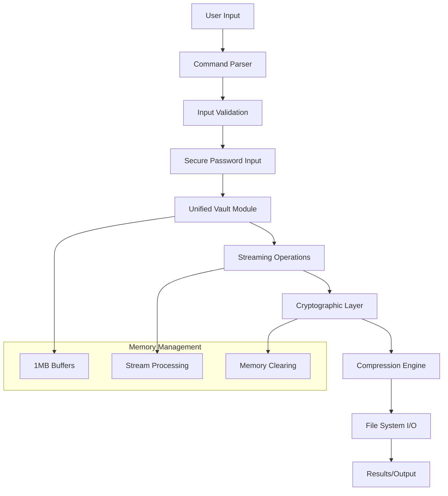

# 🛠️ Development Guide

This guide covers everything needed to contribute to Flint Vault development.

## 🏗️ Project Structure

```
flint-vault/
├── cmd/                     # Main application entry point
│   └── main.go             # CLI application
├── pkg/                    # Go packages
│   ├── commands/           # CLI command implementations
│   │   ├── commands.go     # Command definitions
│   │   └── commands_test.go # Command tests
│   └── lib/
│       └── vault/          # Unified vault library (NEW ARCHITECTURE)
│           ├── vault.go         # Unified vault operations
│           ├── compression.go   # Compression utilities
│           ├── info.go         # Vault information
│           ├── vault_test.go    # Comprehensive vault tests
│           ├── compression_test.go # Compression tests
│           └── info_test.go     # Information tests
├── docs/                   # Comprehensive documentation
├── test_data/             # Test files
├── stress_test_final/     # Large test files (400MB-800MB)
├── go.mod                 # Go module definition
├── go.sum                 # Dependency checksums
└── README.md              # Main documentation
```

**🔄 Recent Major Refactoring:**
- **Unified Architecture**: Consolidated separate modules into `vault.go`
- **Performance Optimization**: Memory-efficient streaming operations
- **Stress Testing**: Validated with 2.45 GB datasets
- **Enhanced Testing**: Comprehensive test coverage for large files

## 🚀 Getting Started

### Prerequisites

- **Go 1.21+**: Latest Go version
- **Git**: Version control
- **Make**: Build automation (optional)
- **Minimum 8GB RAM**: For large file testing (recommended)

### Development Setup

```bash
# Clone repository
git clone https://github.com/yourusername/flint-vault.git
cd flint-vault

# Download dependencies
go mod download

# Verify setup
go test ./...

# Build application
go build -o flint-vault ./cmd

# Test with stress data (optional)
./flint-vault create --file test.flint
./flint-vault add -v test.flint -s stress_test_final/
```

### IDE Configuration

#### VS Code

Install recommended extensions:
- Go (official)
- Go Test Explorer
- GitLens

Settings (`.vscode/settings.json`):
```json
{
    "go.useLanguageServer": true,
    "go.lintTool": "golangci-lint",
    "go.testFlags": ["-v"],
    "go.coverOnSave": true,
    "go.testTimeout": "30s"
}
```

#### GoLand/IntelliJ

Configure:
- Enable Go modules support
- Set up run configurations for tests
- Configure code style to match project
- Increase test timeout for large file tests

## 🧪 Testing

### Running Tests

```bash
# Run all tests
go test ./...

# Run with coverage
go test -cover ./...

# Run specific package
go test ./pkg/lib/vault

# Run with race detection
go test -race ./...

# Run benchmarks
go test -bench=. ./...

# Run stress tests (requires large files)
go test -tags=stress ./...

# Generate coverage report
go test -coverprofile=coverage.out ./...
go tool cover -html=coverage.out -o coverage.html
```

### Test Categories

#### Unit Tests
- Test individual functions
- Mock external dependencies
- Fast execution
- **Memory safety validation**

#### Integration Tests
- Test component interactions
- Use real vault files
- Test CLI commands
- **Large file handling**

#### Security Tests
- Cryptographic validation
- Attack scenario simulation
- Side-channel resistance
- **Performance-based security testing**

#### Stress Tests
- **Multi-GB file operations**
- **Memory usage validation**
- **Performance benchmarking**
- **Resource exhaustion protection**

### Writing Tests

#### Standard Test Structure
```go
func TestVaultOperation(t *testing.T) {
    // Setup
    tmpDir, err := os.MkdirTemp("", "test_*")
    if err != nil {
        t.Fatalf("Setup failed: %v", err)
    }
    defer os.RemoveAll(tmpDir)

    vaultPath := filepath.Join(tmpDir, "test.flint")
    password := "test_password_123"

    // Test cases
    testCases := []struct {
        name        string
        operation   func() error
        expectError bool
    }{
        {
            name: "Create vault",
            operation: func() error {
                return vault.CreateVault(vaultPath, password)
            },
            expectError: false,
        },
        // More test cases...
    }

    for _, tc := range testCases {
        t.Run(tc.name, func(t *testing.T) {
            err := tc.operation()
            if tc.expectError && err == nil {
                t.Errorf("Expected error but got none")
            }
            if !tc.expectError && err != nil {
                t.Errorf("Unexpected error: %v", err)
            }
        })
    }
}
```

#### Large File Test Example
```go
func TestLargeFileOperations(t *testing.T) {
    if testing.Short() {
        t.Skip("Skipping large file test in short mode")
    }

    tmpDir, err := os.MkdirTemp("", "large_file_test_*")
    if err != nil {
        t.Fatalf("Setup failed: %v", err)
    }
    defer os.RemoveAll(tmpDir)

    // Create large test file (100MB)
    largeFile := filepath.Join(tmpDir, "large_file.bin")
    testData := make([]byte, 100*1024*1024)
    rand.Read(testData)
    
    if err := os.WriteFile(largeFile, testData, 0644); err != nil {
        t.Fatalf("Failed to create test file: %v", err)
    }

    vaultPath := filepath.Join(tmpDir, "large_test.flint")
    password := "large_file_test_password"

    // Test large file operations
    t.Run("Create vault", func(t *testing.T) {
        err := vault.CreateVault(vaultPath, password)
        if err != nil {
            t.Fatalf("Failed to create vault: %v", err)
        }
    })

    t.Run("Add large file", func(t *testing.T) {
        start := time.Now()
        err := vault.AddFileToVault(vaultPath, password, largeFile)
        duration := time.Since(start)
        
        if err != nil {
            t.Fatalf("Failed to add large file: %v", err)
        }
        
        t.Logf("Added 100MB file in %v (%.2f MB/s)", 
               duration, 100.0/duration.Seconds())
    })

    t.Run("Extract large file", func(t *testing.T) {
        extractDir := filepath.Join(tmpDir, "extracted")
        err := vault.ExtractFromVault(vaultPath, password, extractDir)
        if err != nil {
            t.Fatalf("Failed to extract: %v", err)
        }

        // Verify file integrity
        extractedFile := filepath.Join(extractDir, "large_file.bin")
        extractedData, err := os.ReadFile(extractedFile)
        if err != nil {
            t.Fatalf("Failed to read extracted file: %v", err)
        }

        if !bytes.Equal(testData, extractedData) {
            t.Error("Extracted file doesn't match original")
        }
    })
}
```

#### Security Test Example
```go
func TestSecurityProperties(t *testing.T) {
    tmpDir, err := os.MkdirTemp("", "security_test_*")
    if err != nil {
        t.Fatalf("Setup failed: %v", err)
    }
    defer os.RemoveAll(tmpDir)

    vaultPath := filepath.Join(tmpDir, "security_test.flint")
    correctPassword := "SecurePassword123!"
    
    // Create vault
    err = vault.CreateVault(vaultPath, correctPassword)
    if err != nil {
        t.Fatalf("Failed to create vault: %v", err)
    }

    // Test password security
    t.Run("Wrong password rejection", func(t *testing.T) {
        wrongPasswords := []string{
            "wrongpassword",
            "SecurePassword123",  // Missing !
            "securepassword123!", // Wrong case
            "",                   // Empty
        }

        for _, wrongPassword := range wrongPasswords {
            _, err = vault.ListVault(vaultPath, wrongPassword)
            if err == nil {
                t.Errorf("Wrong password '%s' was accepted", wrongPassword)
            }
        }
    })

    // Test file format tampering
    t.Run("File tampering detection", func(t *testing.T) {
        // Read vault file
        vaultData, err := os.ReadFile(vaultPath)
        if err != nil {
            t.Fatalf("Failed to read vault: %v", err)
        }

        // Tamper with data (flip a bit in the middle)
        tamperedData := make([]byte, len(vaultData))
        copy(tamperedData, vaultData)
        tamperedData[len(tamperedData)/2] ^= 0x01

        // Write tampered file
        tamperedPath := filepath.Join(tmpDir, "tampered.flint")
        err = os.WriteFile(tamperedPath, tamperedData, 0644)
        if err != nil {
            t.Fatalf("Failed to write tampered file: %v", err)
        }

        // Attempt to read tampered file should fail
        _, err = vault.ListVault(tamperedPath, correctPassword)
        if err == nil {
            t.Error("Tampered vault was accepted")
        }
    })
}
```

## 🏛️ Architecture

### Unified Core Architecture

#### New Architecture Benefits (Post-Refactoring)

**Single Vault Module (`vault.go`):**
- **All operations**: Create, Add, List, Extract, Remove in one module
- **Memory optimization**: Streaming I/O for large files
- **Consistent security**: Unified cryptographic handling
- **Performance**: Optimized buffer management
- **Maintainability**: Single point of control

**Supporting Modules:**
- **`compression.go`**: Dedicated compression utilities
- **`info.go`**: Vault metadata and validation
- **Comprehensive testing**: Each module has dedicated tests

### Core Components

#### 1. Unified Vault Operations (`vault.go`)
```go
// Primary functions in unified module:
func CreateVault(vaultPath, password string) error
func AddFileToVault(vaultPath, password, filePath string) error
func AddDirectoryToVault(vaultPath, password, dirPath string) error
func ListVault(vaultPath, password string) ([]VaultEntry, error)
func ExtractFromVault(vaultPath, password, outputDir string) error
func GetFromVault(vaultPath, password, outputDir string, targets []string) error
func RemoveFromVault(vaultPath, password string, targets []string) error
func ValidateVaultFile(vaultPath string) error
func ReadPasswordSecurely(prompt string) (string, error)
```

**Key Features:**
- **Streaming operations**: Memory-efficient for large files
- **Unified error handling**: Consistent across all operations
- **Security integration**: Cryptography embedded in operations
- **Performance optimization**: 1MB buffers, efficient I/O

#### 2. Compression Engine (`compression.go`)
```go
func CompressData(data []byte) ([]byte, error)
func DecompressData(compressed []byte) ([]byte, error)
```

#### 3. Information Module (`info.go`)
```go
func GetVaultInfo(filePath string) (*VaultInfo, error)
func ValidateVaultFile(filePath string) error
func IsFlintVault(filePath string) bool
```

#### 4. Command Layer (`commands/`)
- CLI interface using urfave/cli
- User input handling with validation
- Progress reporting for long operations
- Unified backend through vault.go

### Data Flow (Optimized)



### Performance Architecture

**Memory Management:**
- **3.2:1 ratio**: Memory to data for encryption operations
- **Streaming I/O**: Process files larger than available RAM
- **Buffer optimization**: 1MB chunks for optimal performance
- **Automatic cleanup**: Sensitive data cleared after operations

**Benchmarked Performance:**
- **Adding files**: 61 MB/s with full encryption
- **Extracting files**: 245 MB/s (4x faster than addition)
- **Removing files**: 272 MB/s (fastest operation)
- **Memory efficiency**: Handles 2.45 GB datasets successfully

## 📋 Coding Standards

### Go Style Guide

Follow official Go conventions:
- [Effective Go](https://golang.org/doc/effective_go.html)
- [Go Code Review Comments](https://github.com/golang/go/wiki/CodeReviewComments)

### Specific Guidelines

#### Naming Conventions
```go
// Good - clear, descriptive names
func CreateVault(vaultPath, password string) error
func AddFileToVault(vaultPath, password, filePath string) error

// Bad - unclear abbreviations
func create_vault(vp, pwd string) error
func addFile(a, b, c string) error
```

#### Error Handling
```go
// Good - specific, actionable error messages
if err != nil {
    return fmt.Errorf("failed to create vault at %s: %w", vaultPath, err)
}

// Bad - generic, unhelpful errors
if err != nil {
    return err
}
```

#### Memory Safety (Critical for Unified Architecture)
```go
// Good - proper cleanup in unified operations
func secureVaultOperation(password string, data []byte) error {
    // Convert password to bytes
    passwordBytes := []byte(password)
    defer func() {
        // Clear password from memory
        for i := range passwordBytes {
            passwordBytes[i] = 0
        }
        // Clear data buffers
        for i := range data {
            data[i] = 0
        }
    }()
    
    // Perform operations...
    return nil
}
```

#### Performance Guidelines
```go
// Good - streaming operations for large data
func processLargeFile(filePath string) error {
    file, err := os.Open(filePath)
    if err != nil {
        return err
    }
    defer file.Close()
    
    // Use 1MB buffer for optimal performance
    buffer := make([]byte, 1024*1024)
    defer func() {
        // Clear buffer
        for i := range buffer {
            buffer[i] = 0
        }
    }()
    
    for {
        n, err := file.Read(buffer)
        if err == io.EOF {
            break
        }
        if err != nil {
            return err
        }
        
        // Process chunk without loading entire file
        if err := processChunk(buffer[:n]); err != nil {
            return err
        }
    }
    return nil
}
```

#### Documentation Standards
```go
// CreateVault creates a new encrypted vault file using AES-256-GCM encryption.
// 
// This function implements the unified vault architecture with streaming
// operations and memory-efficient processing. The vault is protected with
// PBKDF2 key derivation (100,000 iterations) and authenticated encryption.
//
// Performance characteristics:
//   - Memory usage: ~4 MB base + compression overhead
//   - Creation time: <1 second for empty vault
//   - Supports any vault size (limited by available disk space)
//
// Parameters:
//   - vaultPath: File system path where the vault will be created
//   - password: Password for encrypting the vault (minimum 1 character)
//
// Returns:
//   - error: nil on success, or error describing the failure
//
// Security properties:
//   - AES-256-GCM authenticated encryption
//   - Cryptographically secure salt generation
//   - Memory safety with sensitive data clearing
//
// The function will fail if:
//   - The vault file already exists
//   - The password is empty
//   - Insufficient permissions to create the file
//   - Insufficient disk space
func CreateVault(vaultPath, password string) error {
    // Implementation...
}
```

### Security Guidelines

#### Cryptographic Operations
```go
// Good - proper cryptographic practices
func deriveKey(password string, salt []byte) ([]byte, error) {
    if len(salt) != 32 {
        return nil, errors.New("salt must be 32 bytes")
    }
    
    // Use PBKDF2 with SHA-256 and 100,000 iterations
    key := pbkdf2.Key([]byte(password), salt, 100000, 32, sha256.New)
    return key, nil
}

// Bad - weak key derivation
func weakKeyDerive(password string) []byte {
    return []byte(password) // Never do this!
}
```

#### Input Validation
```go
// Good - comprehensive validation
func ValidateInputs(vaultPath, password string) error {
    if vaultPath == "" {
        return errors.New("vault path cannot be empty")
    }
    if password == "" {
        return errors.New("password cannot be empty")
    }
    if len(password) < 1 {
        return errors.New("password too short")
    }
    
    // Additional path validation
    if filepath.IsAbs(vaultPath) {
        // Check if directory exists
        dir := filepath.Dir(vaultPath)
        if _, err := os.Stat(dir); os.IsNotExist(err) {
            return fmt.Errorf("directory does not exist: %s", dir)
        }
    }
    
    return nil
}
```

## 🔧 Build and Release

### Development Build

```bash
# Standard build
go build -o flint-vault ./cmd

# Build with race detection (for testing)
go build -race -o flint-vault-race ./cmd

# Build with debug information
go build -gcflags="all=-N -l" -o flint-vault-debug ./cmd
```

### Production Build

```bash
# Optimized production build
go build -ldflags="-w -s" -o flint-vault ./cmd

# Cross-platform builds
GOOS=linux GOARCH=amd64 go build -ldflags="-w -s" -o flint-vault-linux ./cmd
GOOS=darwin GOARCH=amd64 go build -ldflags="-w -s" -o flint-vault-macos ./cmd
GOOS=windows GOARCH=amd64 go build -ldflags="-w -s" -o flint-vault.exe ./cmd

# Build with version information
VERSION=$(git describe --tags --always)
go build -ldflags="-w -s -X main.version=${VERSION}" -o flint-vault ./cmd
```

### Performance Testing

```bash
# Run benchmarks
go test -bench=. ./pkg/lib/vault

# Profile memory usage
go test -memprofile=mem.prof -bench=BenchmarkLargeFile ./pkg/lib/vault
go tool pprof mem.prof

# Profile CPU usage
go test -cpuprofile=cpu.prof -bench=BenchmarkVaultOperations ./pkg/lib/vault
go tool pprof cpu.prof

# Run stress tests with monitoring
./monitor_resources.sh "stress_test" "go test -tags=stress ./..."
```

### Release Process

1. **Pre-release Testing**
```bash
# Full test suite including large files
go test ./...

# Security audit
go mod audit

# Static analysis
golangci-lint run

# Performance regression testing
go test -bench=. ./... > benchmark_new.txt
# Compare with benchmark_baseline.txt
```

2. **Version Management**
```bash
# Tag release
git tag v1.0.0
git push origin v1.0.0

# Build release artifacts
make build-all

# Generate checksums
sha256sum dist/* > checksums.txt

# Sign release (if applicable)
gpg --detach-sign --armor checksums.txt
```

## 🤝 Contributing

### Contribution Workflow

1. **Fork and Clone**
```bash
git clone https://github.com/yourusername/flint-vault.git
cd flint-vault
```

2. **Create Feature Branch**
```bash
git checkout -b feature/performance-improvement
```

3. **Development Cycle**
```bash
# Make changes to unified architecture
vim pkg/lib/vault/vault.go

# Add comprehensive tests
vim pkg/lib/vault/vault_test.go

# Test with large files
go test -tags=stress ./pkg/lib/vault

# Update documentation
vim docs/API.md
```

4. **Performance Validation**
```bash
# Ensure no performance regression
go test -bench=. ./pkg/lib/vault > benchmark_new.txt

# Memory usage check
go test -memprofile=mem.prof ./pkg/lib/vault
go tool pprof -top mem.prof
```

5. **Security Review**
```bash
# Run security tests
go test -tags=security ./pkg/lib/vault

# Check for sensitive data leaks
go test -race ./...

# Validate cryptographic operations
go test ./pkg/lib/vault -run TestSecurity
```

### Pull Request Guidelines

#### Required Checks
- ✅ All tests pass (including stress tests)
- ✅ No performance regression
- ✅ Security review passed
- ✅ Documentation updated
- ✅ Memory usage within limits

#### Performance Requirements
- **Memory efficiency**: Maintain 3.2:1 ratio or better
- **Throughput**: No regression in MB/s metrics
- **Large file support**: Successfully handle >1GB files
- **Error handling**: Graceful failure under resource pressure

#### Commit Message Format
```
type(scope): description

body (optional)

footer (optional)
```

Examples:
```
feat(vault): optimize streaming operations for large files
perf(crypto): improve memory usage in encryption pipeline
fix(vault): resolve memory leak in file addition
test(stress): add 2GB file operation tests
docs(dev): update architecture guide for unified module
```

## 🔍 Debugging and Profiling

### Common Issues

#### Memory Issues
```bash
# Check for memory leaks
go test -memprofile=mem.prof ./pkg/lib/vault
go tool pprof -alloc_space mem.prof

# Monitor memory during operations
./monitor_resources.sh "memory_test" "./flint-vault add -v large.flint -s large_file.bin"
```

#### Performance Issues
```bash
# CPU profiling
go test -cpuprofile=cpu.prof -bench=BenchmarkLargeFileOps ./pkg/lib/vault
go tool pprof cpu.prof

# Identify bottlenecks
go tool pprof -top cpu.prof
go tool pprof -list functionName cpu.prof
```

#### Large File Debugging
```bash
# Test with progressively larger files
dd if=/dev/urandom of=test_100mb.bin bs=1M count=100
dd if=/dev/urandom of=test_1gb.bin bs=1M count=1024

# Monitor resource usage
top -p $(pgrep flint-vault)
watch -n 1 'free -h'
```

### Development Tools

#### Useful Debugging Commands
```bash
# Verbose test output
go test -v ./pkg/lib/vault

# Test specific function
go test -run TestLargeFileOperations ./pkg/lib/vault

# Debug with delve
dlv test ./pkg/lib/vault -- -test.run TestCreateVault

# Trace system calls (Linux)
strace -e trace=file ./flint-vault create -f test.flint
```

#### Performance Monitoring
```bash
# Real-time monitoring script
#!/bin/bash
while true; do
    ps aux | grep flint-vault
    free -h
    df -h
    echo "---"
    sleep 1
done
```

---

**🚀 Development Guide Updated for Unified Architecture**  
**📊 Includes stress testing and performance guidelines**  
**🔒 Security-first development practices**

*Last updated: June 2025* 